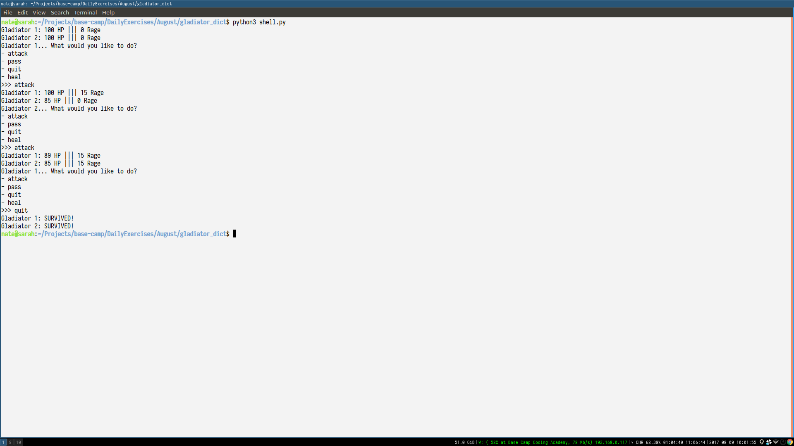

# Gladiators!

For this assignment, you will create a gladiator combat game.
The gladiators will take turns bludgeoning each other until one loses.

# Implementation Details

## Core

Your gladiators will be implemented as a dictionary with 4 key-value pairs:

- health : an integer between 0 and 100
- rage : an integer between 0 and 100
- damage_low : an integer
- damage_high : an integer

You will define the following functions in `core.py` (*and test them in `test_core.py`!*):

```python
def new_gladiator(health, rage, damage_low, damage_high):
```

Returns the dictionary representing the gladiator with the provided values.

```python
def attack(attacker, defender):
```

- Each attack can hit normally or crit
- Crit chance is the same as the attacker's rage (50 rage == 50% crit chance)
- Damage dealt is a random integer between the attacker's damage\_low and damage\_high
- Critting doubles damage dealt
- If a gladiator crits, their rage is reset to 0
- If the gladiator hits normally, their rage is increased by 15

```python
def heal(gladiator):
```

- Spends 10 rage to heal 5 health
- Cannot heal above max health of 100

```python
def is_dead(gladiator):
```

- Returns True iff gladiator has no health

## Shell

Use the functions you've created in `core.py` to build the shell for actually doing the fighting.

## Disk

No disk interaction is required for this assignment.

# Example Output

